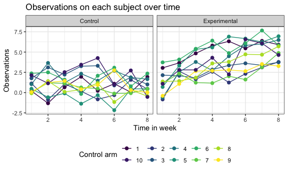

p8105_hw5_ys3508
================
2022-11-16

# Writing Function

``` r
library(tidyverse)
```

    ## ── Attaching packages ─────────────────────────────────────── tidyverse 1.3.2 ──
    ## ✔ ggplot2 3.3.6      ✔ purrr   0.3.4 
    ## ✔ tibble  3.1.8      ✔ dplyr   1.0.10
    ## ✔ tidyr   1.2.0      ✔ stringr 1.4.1 
    ## ✔ readr   2.1.2      ✔ forcats 0.5.2 
    ## ── Conflicts ────────────────────────────────────────── tidyverse_conflicts() ──
    ## ✖ dplyr::filter() masks stats::filter()
    ## ✖ dplyr::lag()    masks stats::lag()

``` r
library(rvest)
```

    ## 
    ## Attaching package: 'rvest'
    ## 
    ## The following object is masked from 'package:readr':
    ## 
    ##     guess_encoding

``` r
library (readr)

knitr::opts_chunk$set(
    echo = TRUE,
    warning = FALSE,
  fig.width = 6,
  fig.asp = .6,
  out.width = "90%"
)

theme_set(theme_minimal() + theme(legend.position = "bottom"))

options(
  ggplot2.continuous.colour = "viridis",
  ggplot2.continuous.fill = "viridis"
)

scale_colour_discrete = scale_colour_viridis_d
scale_fill_discrete = scale_fill_viridis_d
```

## Problem 1

### Create a tidy dataframe

``` r
file_names = list.files(path = "data/problem1", pattern = NULL, all.files = FALSE, full.names = TRUE)
```

Iterate over file names and read in data for each subject using
purrr::map and saving the result as a new variable in the dataframe

``` r
#using map + read_csv function
hw1 = map(file_names, read_csv)
```

    ## Rows: 1 Columns: 8
    ## ── Column specification ────────────────────────────────────────────────────────
    ## Delimiter: ","
    ## dbl (8): week_1, week_2, week_3, week_4, week_5, week_6, week_7, week_8
    ## 
    ## ℹ Use `spec()` to retrieve the full column specification for this data.
    ## ℹ Specify the column types or set `show_col_types = FALSE` to quiet this message.
    ## Rows: 1 Columns: 8
    ## ── Column specification ────────────────────────────────────────────────────────
    ## Delimiter: ","
    ## dbl (8): week_1, week_2, week_3, week_4, week_5, week_6, week_7, week_8
    ## 
    ## ℹ Use `spec()` to retrieve the full column specification for this data.
    ## ℹ Specify the column types or set `show_col_types = FALSE` to quiet this message.
    ## Rows: 1 Columns: 8
    ## ── Column specification ────────────────────────────────────────────────────────
    ## Delimiter: ","
    ## dbl (8): week_1, week_2, week_3, week_4, week_5, week_6, week_7, week_8
    ## 
    ## ℹ Use `spec()` to retrieve the full column specification for this data.
    ## ℹ Specify the column types or set `show_col_types = FALSE` to quiet this message.
    ## Rows: 1 Columns: 8
    ## ── Column specification ────────────────────────────────────────────────────────
    ## Delimiter: ","
    ## dbl (8): week_1, week_2, week_3, week_4, week_5, week_6, week_7, week_8
    ## 
    ## ℹ Use `spec()` to retrieve the full column specification for this data.
    ## ℹ Specify the column types or set `show_col_types = FALSE` to quiet this message.
    ## Rows: 1 Columns: 8
    ## ── Column specification ────────────────────────────────────────────────────────
    ## Delimiter: ","
    ## dbl (8): week_1, week_2, week_3, week_4, week_5, week_6, week_7, week_8
    ## 
    ## ℹ Use `spec()` to retrieve the full column specification for this data.
    ## ℹ Specify the column types or set `show_col_types = FALSE` to quiet this message.
    ## Rows: 1 Columns: 8
    ## ── Column specification ────────────────────────────────────────────────────────
    ## Delimiter: ","
    ## dbl (8): week_1, week_2, week_3, week_4, week_5, week_6, week_7, week_8
    ## 
    ## ℹ Use `spec()` to retrieve the full column specification for this data.
    ## ℹ Specify the column types or set `show_col_types = FALSE` to quiet this message.
    ## Rows: 1 Columns: 8
    ## ── Column specification ────────────────────────────────────────────────────────
    ## Delimiter: ","
    ## dbl (8): week_1, week_2, week_3, week_4, week_5, week_6, week_7, week_8
    ## 
    ## ℹ Use `spec()` to retrieve the full column specification for this data.
    ## ℹ Specify the column types or set `show_col_types = FALSE` to quiet this message.
    ## Rows: 1 Columns: 8
    ## ── Column specification ────────────────────────────────────────────────────────
    ## Delimiter: ","
    ## dbl (8): week_1, week_2, week_3, week_4, week_5, week_6, week_7, week_8
    ## 
    ## ℹ Use `spec()` to retrieve the full column specification for this data.
    ## ℹ Specify the column types or set `show_col_types = FALSE` to quiet this message.
    ## Rows: 1 Columns: 8
    ## ── Column specification ────────────────────────────────────────────────────────
    ## Delimiter: ","
    ## dbl (8): week_1, week_2, week_3, week_4, week_5, week_6, week_7, week_8
    ## 
    ## ℹ Use `spec()` to retrieve the full column specification for this data.
    ## ℹ Specify the column types or set `show_col_types = FALSE` to quiet this message.
    ## Rows: 1 Columns: 8
    ## ── Column specification ────────────────────────────────────────────────────────
    ## Delimiter: ","
    ## dbl (8): week_1, week_2, week_3, week_4, week_5, week_6, week_7, week_8
    ## 
    ## ℹ Use `spec()` to retrieve the full column specification for this data.
    ## ℹ Specify the column types or set `show_col_types = FALSE` to quiet this message.
    ## Rows: 1 Columns: 8
    ## ── Column specification ────────────────────────────────────────────────────────
    ## Delimiter: ","
    ## dbl (8): week_1, week_2, week_3, week_4, week_5, week_6, week_7, week_8
    ## 
    ## ℹ Use `spec()` to retrieve the full column specification for this data.
    ## ℹ Specify the column types or set `show_col_types = FALSE` to quiet this message.
    ## Rows: 1 Columns: 8
    ## ── Column specification ────────────────────────────────────────────────────────
    ## Delimiter: ","
    ## dbl (8): week_1, week_2, week_3, week_4, week_5, week_6, week_7, week_8
    ## 
    ## ℹ Use `spec()` to retrieve the full column specification for this data.
    ## ℹ Specify the column types or set `show_col_types = FALSE` to quiet this message.
    ## Rows: 1 Columns: 8
    ## ── Column specification ────────────────────────────────────────────────────────
    ## Delimiter: ","
    ## dbl (8): week_1, week_2, week_3, week_4, week_5, week_6, week_7, week_8
    ## 
    ## ℹ Use `spec()` to retrieve the full column specification for this data.
    ## ℹ Specify the column types or set `show_col_types = FALSE` to quiet this message.
    ## Rows: 1 Columns: 8
    ## ── Column specification ────────────────────────────────────────────────────────
    ## Delimiter: ","
    ## dbl (8): week_1, week_2, week_3, week_4, week_5, week_6, week_7, week_8
    ## 
    ## ℹ Use `spec()` to retrieve the full column specification for this data.
    ## ℹ Specify the column types or set `show_col_types = FALSE` to quiet this message.
    ## Rows: 1 Columns: 8
    ## ── Column specification ────────────────────────────────────────────────────────
    ## Delimiter: ","
    ## dbl (8): week_1, week_2, week_3, week_4, week_5, week_6, week_7, week_8
    ## 
    ## ℹ Use `spec()` to retrieve the full column specification for this data.
    ## ℹ Specify the column types or set `show_col_types = FALSE` to quiet this message.
    ## Rows: 1 Columns: 8
    ## ── Column specification ────────────────────────────────────────────────────────
    ## Delimiter: ","
    ## dbl (8): week_1, week_2, week_3, week_4, week_5, week_6, week_7, week_8
    ## 
    ## ℹ Use `spec()` to retrieve the full column specification for this data.
    ## ℹ Specify the column types or set `show_col_types = FALSE` to quiet this message.
    ## Rows: 1 Columns: 8
    ## ── Column specification ────────────────────────────────────────────────────────
    ## Delimiter: ","
    ## dbl (8): week_1, week_2, week_3, week_4, week_5, week_6, week_7, week_8
    ## 
    ## ℹ Use `spec()` to retrieve the full column specification for this data.
    ## ℹ Specify the column types or set `show_col_types = FALSE` to quiet this message.
    ## Rows: 1 Columns: 8
    ## ── Column specification ────────────────────────────────────────────────────────
    ## Delimiter: ","
    ## dbl (8): week_1, week_2, week_3, week_4, week_5, week_6, week_7, week_8
    ## 
    ## ℹ Use `spec()` to retrieve the full column specification for this data.
    ## ℹ Specify the column types or set `show_col_types = FALSE` to quiet this message.
    ## Rows: 1 Columns: 8
    ## ── Column specification ────────────────────────────────────────────────────────
    ## Delimiter: ","
    ## dbl (8): week_1, week_2, week_3, week_4, week_5, week_6, week_7, week_8
    ## 
    ## ℹ Use `spec()` to retrieve the full column specification for this data.
    ## ℹ Specify the column types or set `show_col_types = FALSE` to quiet this message.
    ## Rows: 1 Columns: 8
    ## ── Column specification ────────────────────────────────────────────────────────
    ## Delimiter: ","
    ## dbl (8): week_1, week_2, week_3, week_4, week_5, week_6, week_7, week_8
    ## 
    ## ℹ Use `spec()` to retrieve the full column specification for this data.
    ## ℹ Specify the column types or set `show_col_types = FALSE` to quiet this message.

``` r
for (i in 1:20) 
  {
  
  if (i < 11) {
    
    hw1 [[i]] = hw1 [[i]] %>% 
      mutate(
        subject_id = i,
        arm = "Control")
  }
  
  else {
    
    hw1 [[i]] = hw1 [[i]] %>% 
      mutate(
        subject_id = i - 10,
        arm = "Experimental")
  }
  
}
```

Tidy the result

``` r
hw1_tidy = hw1 %>%
  bind_rows() %>% 
  pivot_longer(
    week_1:week_8,
    names_to = "week",
    names_prefix = "week_",
    values_to = "observation"
  ) %>%  
  mutate(
    subject_id = as.character(subject_id),
    week = as.numeric(week)
  ) %>% 
  select(subject_id, arm, everything())
```

### Plot

``` r
hw1_tidy %>% 
  ggplot(aes(x = week, y = observation, group = subject_id, colour = subject_id)) +
    labs(x = "Time in week", y = "Observations", color = "Control arm", title = "Observations on each subject over time") + 
    geom_line(size=0.5) +
    geom_point(size=2) +
    facet_grid(. ~ arm) +
    theme_bw() +
    theme(legend.position="bottom")
```



-   The observation values for individuals in the experimental arm are
    greater on average than those in the control arm. Furthermore, there
    appears to be some growth in a fairly linear fashion over time for
    those in the experimental arm, but the observation value for those
    in the control arm tends to be more steady.

## Problem 2

### Import data

``` r
urlfile="https://raw.githubusercontent.com/washingtonpost/data-homicides/master/homicide-data.csv"

hw2 <-read_csv(url(urlfile))
```

    ## Rows: 52179 Columns: 12
    ## ── Column specification ────────────────────────────────────────────────────────
    ## Delimiter: ","
    ## chr (9): uid, victim_last, victim_first, victim_race, victim_age, victim_sex...
    ## dbl (3): reported_date, lat, lon
    ## 
    ## ℹ Use `spec()` to retrieve the full column specification for this data.
    ## ℹ Specify the column types or set `show_col_types = FALSE` to quiet this message.

-   The ‘hw2’ dataset comprises 12 variables with a total of 52179
    observations, detailing murder cases in various cities around the
    United States. These factors include the reported date and location,
    some victim information (name, race, age, and gender), and the
    homicide’s ultimate disposition.

### Create a city_state variable/Summary

``` r
hw2_homicides = hw2 %>% 
 mutate(
    state = str_to_upper(state),
    city_state = str_c(city, ", ", state),
    city_state = recode(city_state, "Tulsa, AL" = "Tulsa, OK"), #error in dataset;
    final_disposition =
          ifelse(disposition == "Closed by arrest" ,"solved", "unsolved")) 

 

hw2_summary = hw2_homicides %>%
  group_by(city_state) %>% 
  summarise(
    total_homicides = n(),
    unsolved_homicides = sum(final_disposition == "unsolved")
  ) %>% 
  knitr::kable(
    col.names = c("City, State", "Total Number of Homicides", "Number of Unsolved Homicides")
  )
hw2_summary
```

| City, State        | Total Number of Homicides | Number of Unsolved Homicides |
|:-------------------|--------------------------:|-----------------------------:|
| Albuquerque, NM    |                       378 |                          146 |
| Atlanta, GA        |                       973 |                          373 |
| Baltimore, MD      |                      2827 |                         1825 |
| Baton Rouge, LA    |                       424 |                          196 |
| Birmingham, AL     |                       800 |                          347 |
| Boston, MA         |                       614 |                          310 |
| Buffalo, NY        |                       521 |                          319 |
| Charlotte, NC      |                       687 |                          206 |
| Chicago, IL        |                      5535 |                         4073 |
| Cincinnati, OH     |                       694 |                          309 |
| Columbus, OH       |                      1084 |                          575 |
| Dallas, TX         |                      1567 |                          754 |
| Denver, CO         |                       312 |                          169 |
| Detroit, MI        |                      2519 |                         1482 |
| Durham, NC         |                       276 |                          101 |
| Fort Worth, TX     |                       549 |                          255 |
| Fresno, CA         |                       487 |                          169 |
| Houston, TX        |                      2942 |                         1493 |
| Indianapolis, IN   |                      1322 |                          594 |
| Jacksonville, FL   |                      1168 |                          597 |
| Kansas City, MO    |                      1190 |                          486 |
| Las Vegas, NV      |                      1381 |                          572 |
| Long Beach, CA     |                       378 |                          156 |
| Los Angeles, CA    |                      2257 |                         1106 |
| Louisville, KY     |                       576 |                          261 |
| Memphis, TN        |                      1514 |                          483 |
| Miami, FL          |                       744 |                          450 |
| Milwaukee, WI      |                      1115 |                          403 |
| Minneapolis, MN    |                       366 |                          187 |
| Nashville, TN      |                       767 |                          278 |
| New Orleans, LA    |                      1434 |                          930 |
| New York, NY       |                       627 |                          243 |
| Oakland, CA        |                       947 |                          508 |
| Oklahoma City, OK  |                       672 |                          326 |
| Omaha, NE          |                       409 |                          169 |
| Philadelphia, PA   |                      3037 |                         1360 |
| Phoenix, AZ        |                       914 |                          504 |
| Pittsburgh, PA     |                       631 |                          337 |
| Richmond, VA       |                       429 |                          113 |
| Sacramento, CA     |                       376 |                          139 |
| San Antonio, TX    |                       833 |                          357 |
| San Bernardino, CA |                       275 |                          170 |
| San Diego, CA      |                       461 |                          175 |
| San Francisco, CA  |                       663 |                          336 |
| Savannah, GA       |                       246 |                          115 |
| St. Louis, MO      |                      1677 |                          905 |
| Stockton, CA       |                       444 |                          266 |
| Tampa, FL          |                       208 |                           95 |
| Tulsa, OK          |                       584 |                          193 |
| Washington, DC     |                      1345 |                          589 |

### `prop.test` function for MD

``` r
hw2_md = hw2_homicides %>% 
  filter(city_state == "Baltimore, MD") 

prop_test = prop.test(1825,2827, conf.level=0.95, correct=FALSE)

broom::tidy(prop_test)
```

    ## # A tibble: 1 × 8
    ##   estimate statistic  p.value parameter conf.low conf.high method        alter…¹
    ##      <dbl>     <dbl>    <dbl>     <int>    <dbl>     <dbl> <chr>         <chr>  
    ## 1    0.646      240. 4.82e-54         1    0.628     0.663 1-sample pro… two.si…
    ## # … with abbreviated variable name ¹​alternative

``` r
prop_test[["estimate"]]
```

    ##         p 
    ## 0.6455607

``` r
prop_test[["conf.int"]]
```

    ## [1] 0.6277411 0.6629852
    ## attr(,"conf.level")
    ## [1] 0.95

-   Using `prop_test[["estimate"]]` and `prop_test[["conf.int"]]` to get
    the estimate of 0.6455607 and confidence intervals from 0.6275625 to
    0.6631599.

### Using `map` for `prop.test`

define the `prop_test` function

``` r
prop_test = function(dataset) {
  
  prop_test = dataset %>%
  summarise(
    total_homicides = n(),
    unsolved_homicides = sum(final_disposition == "unsolved")
  )
  
  test = prop.test(
      prop_test$unsolved_homicides, 
      prop_test$total_homicides, 
      conf.level = 0.95, correct=FALSE
      ) %>% 
    broom::tidy()
   
  test
}
```

use `nest` and `map`

``` r
hw2_nest = hw2_homicides %>%
  select(city_state, everything()) %>% 
  nest(data = uid:final_disposition) 

hw2_unsolved = hw2_nest %>% 
   mutate(test_result = map(data, prop_test)) %>% 
   unnest(test_result) %>% 
   select(city_state, estimate, conf.low, conf.high) %>% 
   knitr::kable(digits = 3)

hw2_unsolved
```

| city_state         | estimate | conf.low | conf.high |
|:-------------------|---------:|---------:|----------:|
| Albuquerque, NM    |    0.386 |    0.339 |     0.436 |
| Atlanta, GA        |    0.383 |    0.353 |     0.414 |
| Baltimore, MD      |    0.646 |    0.628 |     0.663 |
| Baton Rouge, LA    |    0.462 |    0.415 |     0.510 |
| Birmingham, AL     |    0.434 |    0.400 |     0.468 |
| Boston, MA         |    0.505 |    0.465 |     0.544 |
| Buffalo, NY        |    0.612 |    0.570 |     0.653 |
| Charlotte, NC      |    0.300 |    0.267 |     0.335 |
| Chicago, IL        |    0.736 |    0.724 |     0.747 |
| Cincinnati, OH     |    0.445 |    0.409 |     0.482 |
| Columbus, OH       |    0.530 |    0.501 |     0.560 |
| Dallas, TX         |    0.481 |    0.457 |     0.506 |
| Denver, CO         |    0.542 |    0.486 |     0.596 |
| Detroit, MI        |    0.588 |    0.569 |     0.607 |
| Durham, NC         |    0.366 |    0.311 |     0.424 |
| Fort Worth, TX     |    0.464 |    0.423 |     0.506 |
| Fresno, CA         |    0.347 |    0.306 |     0.390 |
| Houston, TX        |    0.507 |    0.489 |     0.526 |
| Indianapolis, IN   |    0.449 |    0.423 |     0.476 |
| Jacksonville, FL   |    0.511 |    0.482 |     0.540 |
| Kansas City, MO    |    0.408 |    0.381 |     0.437 |
| Las Vegas, NV      |    0.414 |    0.388 |     0.440 |
| Long Beach, CA     |    0.413 |    0.364 |     0.463 |
| Los Angeles, CA    |    0.490 |    0.469 |     0.511 |
| Louisville, KY     |    0.453 |    0.413 |     0.494 |
| Memphis, TN        |    0.319 |    0.296 |     0.343 |
| Miami, FL          |    0.605 |    0.569 |     0.639 |
| Milwaukee, WI      |    0.361 |    0.334 |     0.390 |
| Minneapolis, MN    |    0.511 |    0.460 |     0.562 |
| Nashville, TN      |    0.362 |    0.329 |     0.397 |
| New Orleans, LA    |    0.649 |    0.623 |     0.673 |
| New York, NY       |    0.388 |    0.350 |     0.426 |
| Oakland, CA        |    0.536 |    0.505 |     0.568 |
| Oklahoma City, OK  |    0.485 |    0.448 |     0.523 |
| Omaha, NE          |    0.413 |    0.367 |     0.462 |
| Philadelphia, PA   |    0.448 |    0.430 |     0.466 |
| Phoenix, AZ        |    0.551 |    0.519 |     0.583 |
| Pittsburgh, PA     |    0.534 |    0.495 |     0.573 |
| Richmond, VA       |    0.263 |    0.224 |     0.307 |
| San Antonio, TX    |    0.429 |    0.395 |     0.462 |
| Sacramento, CA     |    0.370 |    0.322 |     0.420 |
| Savannah, GA       |    0.467 |    0.406 |     0.530 |
| San Bernardino, CA |    0.618 |    0.560 |     0.674 |
| San Diego, CA      |    0.380 |    0.336 |     0.425 |
| San Francisco, CA  |    0.507 |    0.469 |     0.545 |
| St. Louis, MO      |    0.540 |    0.516 |     0.563 |
| Stockton, CA       |    0.599 |    0.553 |     0.644 |
| Tampa, FL          |    0.457 |    0.390 |     0.525 |
| Tulsa, OK          |    0.330 |    0.294 |     0.370 |
| Washington, DC     |    0.438 |    0.412 |     0.465 |

## Plot
